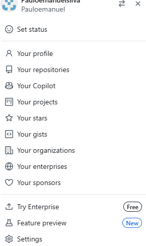
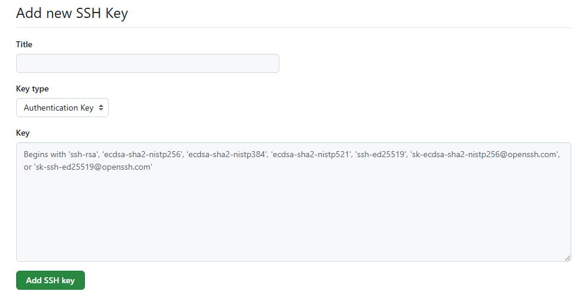
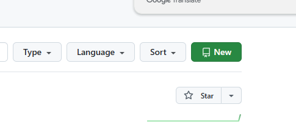
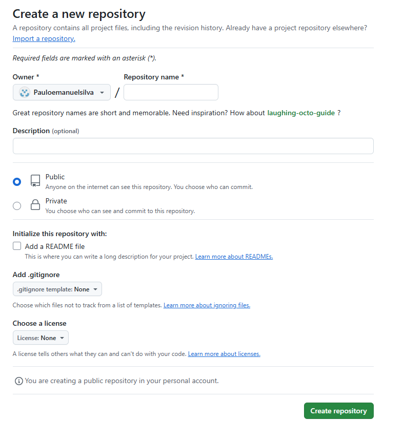

# Manual de utilização do sistema/site.

 ### Antes de iniciar o manual, é necessário verificar se o GitHub está instalado no seu computador. Para isso, use o comando abaixo no terminal. 

 ```
 git --version
 ```
 <p>Se você ainda não tem o Git instalado, siga os passos abaixo:</p>

## CAPITULO 1 - configuração do git no computador.
### Instalação do GIT.

<p align="justify">
Ralize a busca no navegador para a realização [Instalar GIT] (ttps://git-scm.com/book/pt-pt/v2/   Come%C3%A7ando-Instalar-o-Git)</p>

<p align="center"> <a href ="https://git-scm.com/book/pt-pt/v2/Come%C3%A7ando-Instalar-o-Git" target ="black">
   
   </a>
</p>

### CRIE UMA CONTA no GITHUB.

<p>Após instalar o Git, acesse o site do GitHub e crie uma conta. Lá, você poderá escolher o nome de usuário e o e-mail que serão associados à sua conta.</p>

<p>Após criar a conta, você precisará conectá-la ao projeto utilizando os comandos abaixo, através do terminal do seu computador</p>

### Comandos para conetar o seu computador ao GITHUB.
    ```
    git config --global user.name "Digite seu nome" 
    git config --global user.email "Digite seu email"
    ```
   ### Comandos para navegar áte àrea o seu PROJETO.
   ```
   cd documents // Caso o arquivo esteja da pasta esteja oculto, pasta digita o mesmo codigo adcionado espaço e um ponto final ex: "cd documents ."
   cd workspace// o mesmo nesse caso ex: "cd workspace"
   cd projeto // O nome do Projeto e de sua escolha
   cd css
   
   ```


 <p>logo depois disso e nescessaio cria uma chave atraves do comando abaixo, so que antes disso e necessario navegar ate o ssh</p>

### Codigo para gerar a chave
   ```
   cd .ssh
   ssh-keygem
   ls
   cat id
   ```
<p>Depois disso e necessario entra no GITHUB para conecta a chave ao repositorio atraves das ilustrações abaixo</p>

 ### Entre em usuario e click em configurações

<p align="center"> 
   
</p>

### Depois disso click ssh gps

<p align="center"> 
   
   
### Agora use a chave

</p>
<p align="center"> 
   
   </a>
</p>
<p>Dê um nome para o repositório (pode ser público ou privado, conforme preferir).</p>

### CODIGO para verificar se as informações estão corretas
  ```
  git config list
  ```
  <p>Depois de veificar os comandos use o codigo abaixo para se conetar ao VSCODE /OBS: VSCODE e apenas uma ferramenta</p>

  ### CODIGO para se conetar ao VSCODE
  ```
  code .
  ```

## Capitulo 2 - criando repositorio no git
<p>Acesse GitHub, e crie um novo repositório,</p> 
// Clique no botão New para criar um novo repositório.

<p align="center"> 
   
   </a>
</p>

 <p>Dê um nome para o repositório.</p>

 <p align="center"> 
   
   </a>
</p>


 ### Codigo adicionar arquivos ao repositório local
 ```
 git add index.html or git add.
```
### Codigo para adcionar comentarios do desenvolvedor
```
 git commit -m "Mensagem do desenvolvedor" ex: "Updat file README"
```
### Codigo para adcionar informações.
```
 git add.
```
### Codigo para enviar informações
```
 git push -u origin master
```